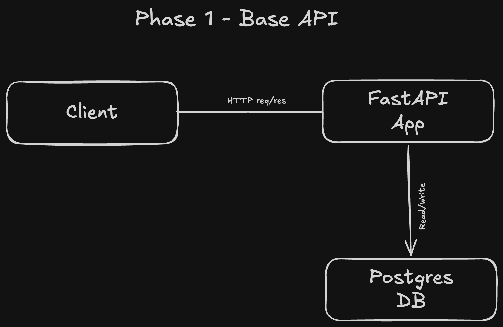

# PaperAI

An AI-powered research assistant backend that fetches, analyses, and maps
relationships between ML research papers — powered by Google Gemini.

## Architecture Overview



## Architectural Evolution

### Phase 1 — Base API (v1-base-api)

**The problem:** Needed a secure, structured foundation for managing
research papers with proper user ownership and normalized data model.

**What was built:**

- REST API with FastAPI and PostgreSQL
- SQLAlchemy async ORM with asyncpg driver
- JWT authentication — access token in body, refresh token in HTTP-only cookie
- Refresh token rotation with revocation via database
- Normalized schema — global papers table + user_papers ownership table
- Manual paper creation with user library management
- Docker Compose environment

**Key decisions:**

- SQLAlchemy ORM over raw asyncpg — complex multi-table relationships
  are cleaner with ORM navigation
- Normalized paper schema — one global paper record shared across users,
  user_papers holds ownership and user-specific state
- Refresh token rotation — each refresh invalidates old token,
  limits damage if token is ever compromised

---

### Services

| Service  | URL                        |
| -------- | -------------------------- |
| API      | http://localhost:8000      |
| API Docs | http://localhost:8000/docs |

## Tech Stack

| Layer    | Technology                 |
| -------- | -------------------------- |
| API      | FastAPI, Python            |
| ORM      | SQLAlchemy async + asyncpg |
| Database | PostgreSQL                 |

## API Endpoints

### Auth

| Method | Endpoint       | Description                               |
| ------ | -------------- | ----------------------------------------- |
| POST   | /auth/register | Register new user                         |
| POST   | /auth/login    | Login, returns access token + sets cookie |
| POST   | /auth/refresh  | Refresh access token via cookie           |
| POST   | /auth/logout   | Logout, revokes refresh token             |
| GET    | /auth/me       | Get current user                          |

### Papers

| Method | Endpoint      | Description                |
| ------ | ------------- | -------------------------- |
| POST   | /paper/manual | Add paper manually         |
| GET    | /paper/       | List all papers in library |
| GET    | /paper/{id}   | Get paper detail           |
| DELETE | /paper/{id}   | Remove from library        |

### Start

```bash
git clone https://github.com/yourusername/paperai
cd paperai
cp .env.example .env
docker compose up
```
